# spa-comments 

Comment SPA app.
A full-stack application that allows you to create, store, and display 
comments with real-time notifications of new comments via WebSocket, 
user registration and authorization, message display with pagination 
of 25 messages per page, sorting, and attachment previews.
Technologies used in the implementation:
Python Django + DRF + Channels (Daphne, Redis) + Vue 3 (Vite) JS, Docker
Authorization/sessions + CSRF (cookie-based)
The structure od database you can see:
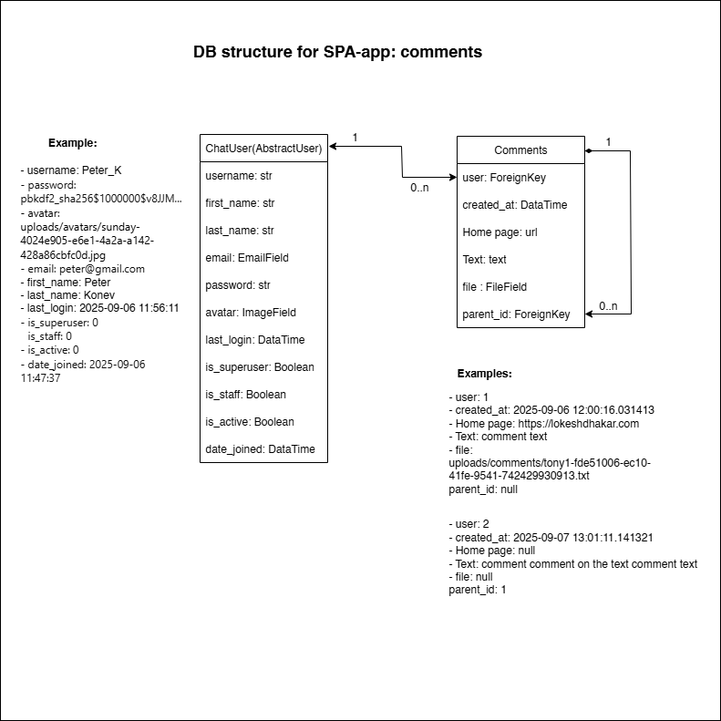

## Features
* Automatic Swagger documentation for the backend has been created.
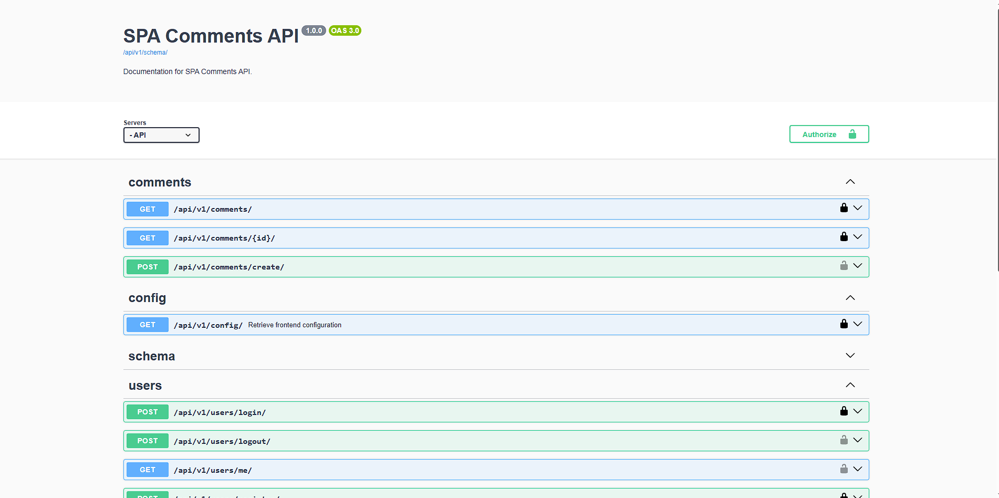
* Powerful admin panel for advanced management 
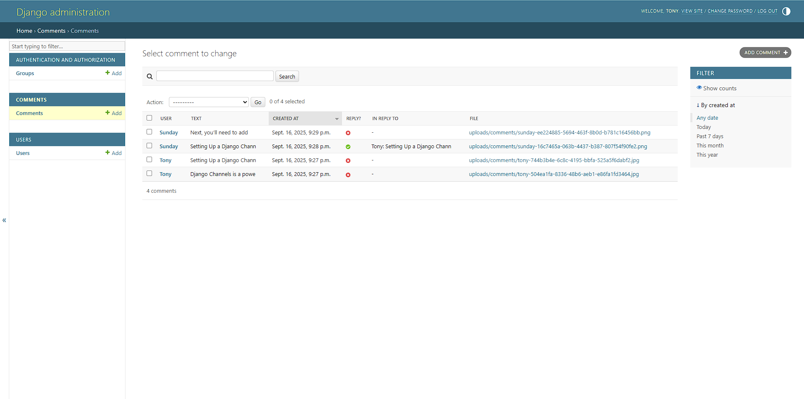
* User registration (user name, email, password, avatar picture) with reCAPTURA by Google
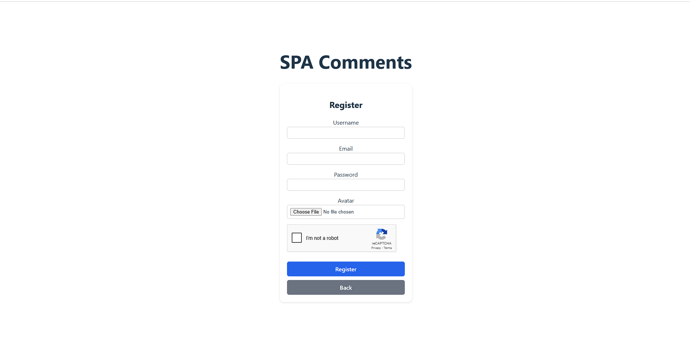
* User login, sign in with reCAPTURA by Google
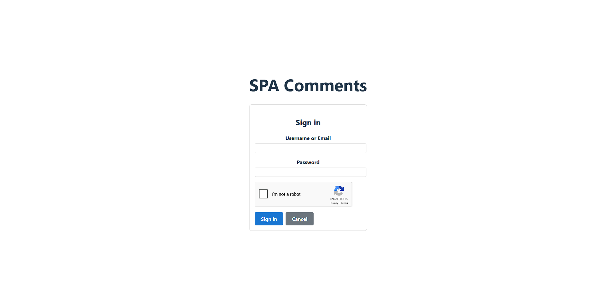
* Only registered users can create new comments
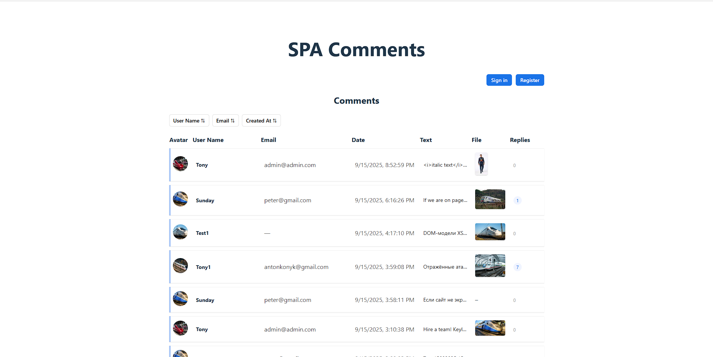
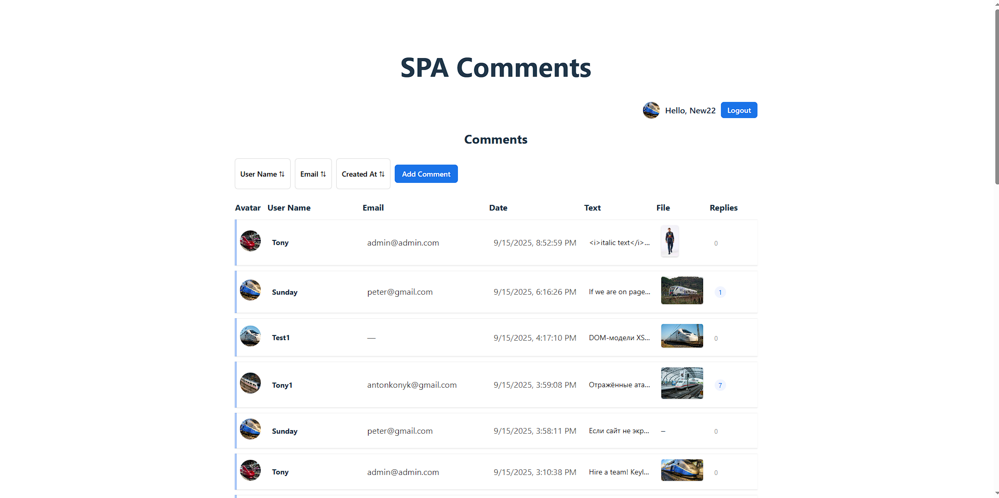
* Pagination of main comments with 25 on each page with page navigation
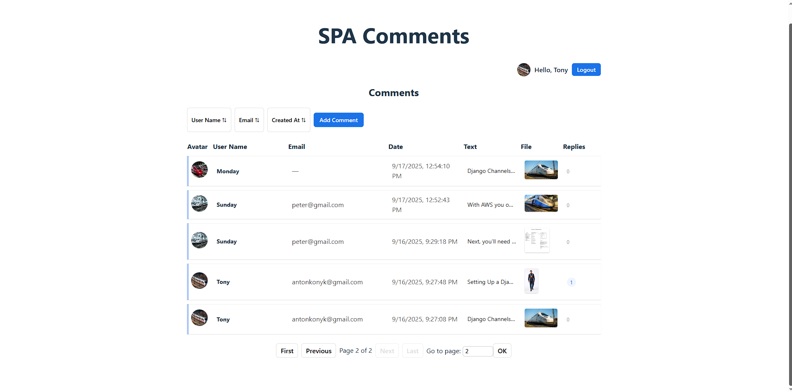
* An ability to sort main messages by the following fields: User Name, email, and date added
* Preview attached files and comment text without reloading the page
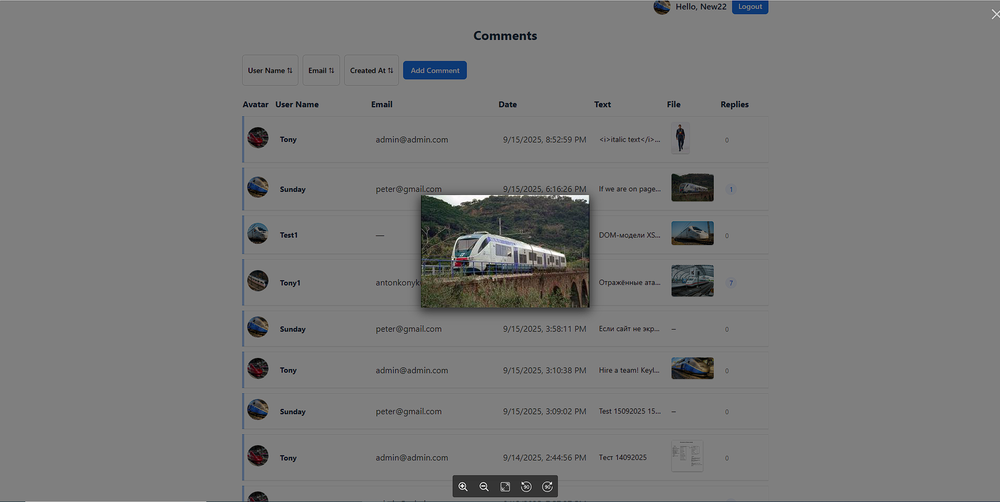
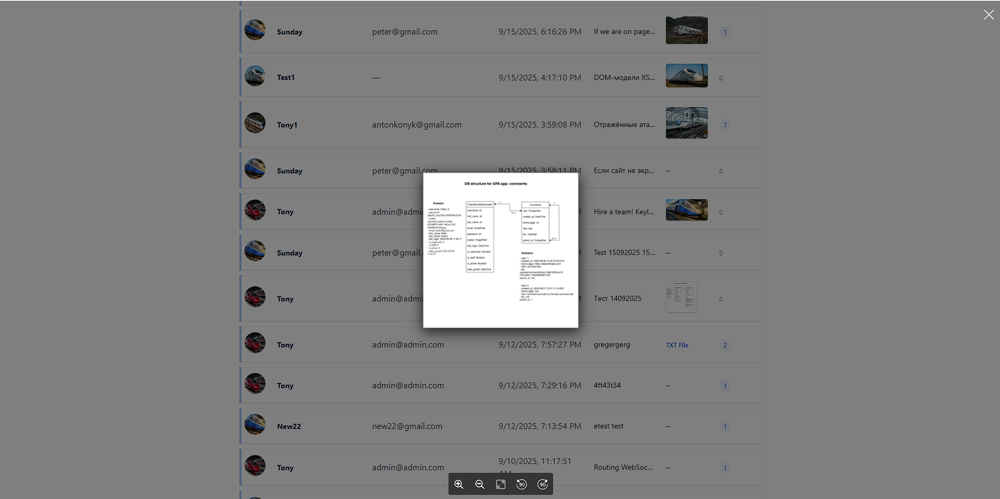
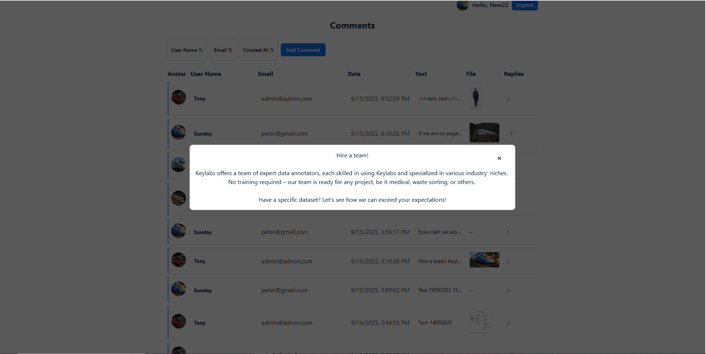
* Main comment branch page with the ability to create a comment as a reply to any message
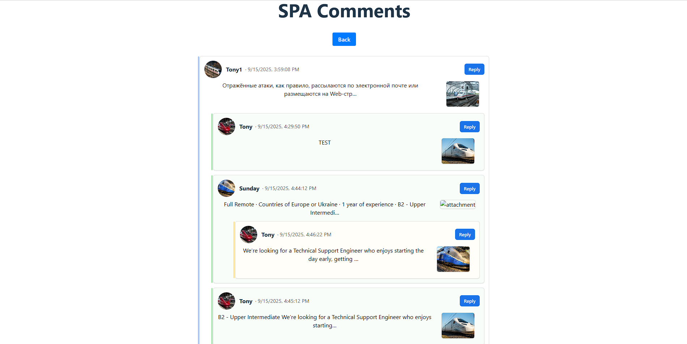
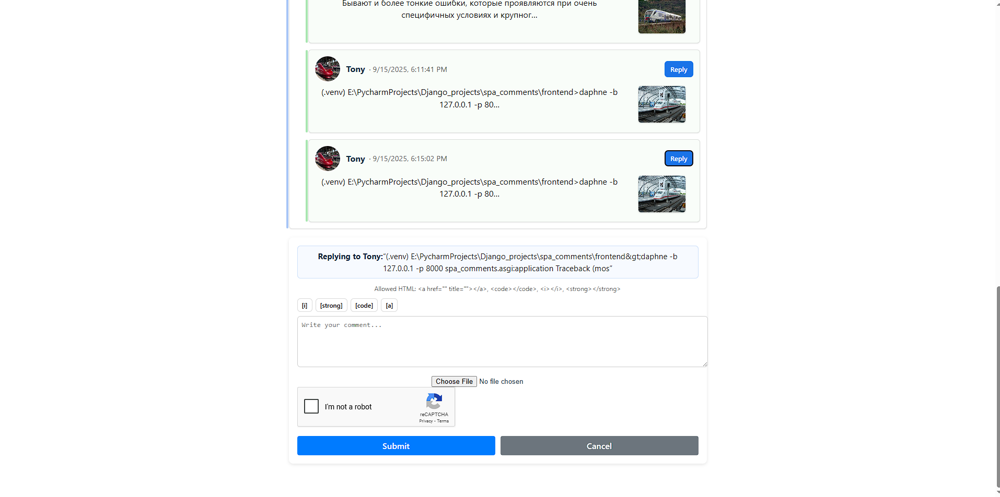
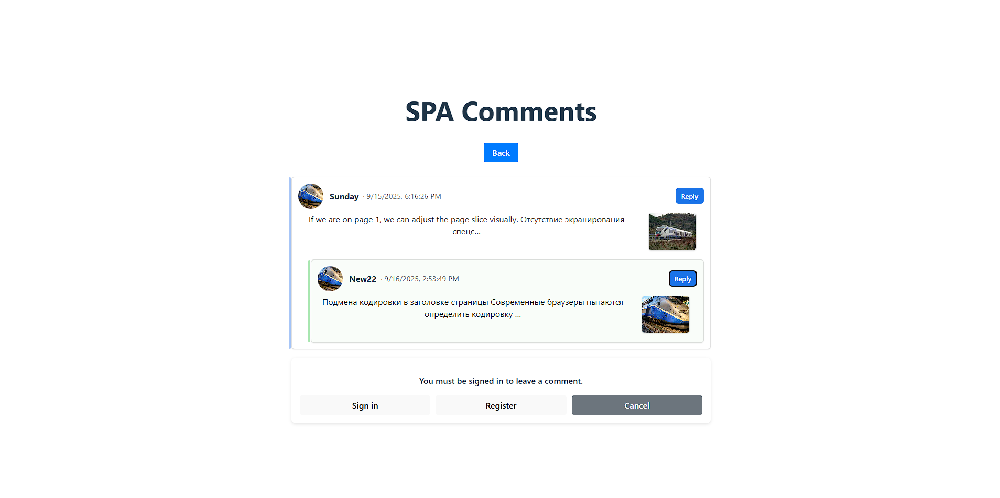
* Creation of new main comments with the ability to interactively add tags using 
the [i], [strong], [code], [a] buttons, the ability to attach a graphic file with 
the extension "jpg", "jpeg", "png", "gif" and text files "txt" to the message
with reCAPTURA by Google
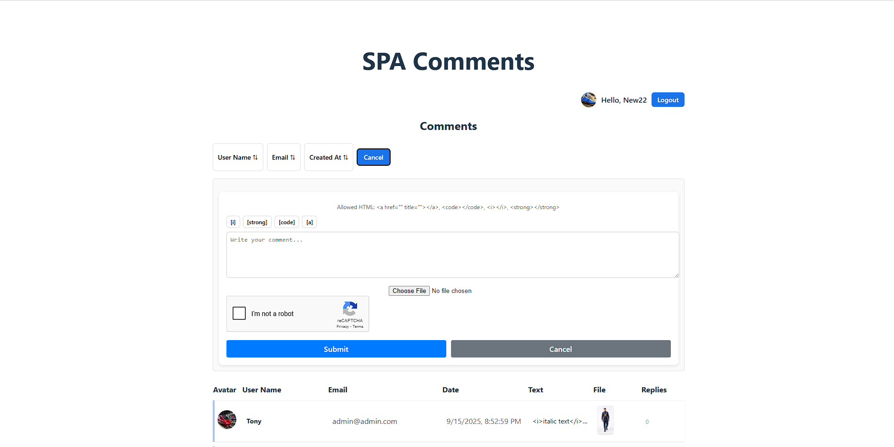
* Uploaded image verification. The image must be no larger than 320x240 pixels.
If you attempt to upload a larger image, it will be proportionally scaled down 
to the specified dimensions. Acceptable file formats are: JPG, JPEG, GIF, and PNG.
The verification process only applies to text files no larger than 100 KB.
* Implemented checking for allowed HTML tags in messages: <a href=”” title=””> 
</a> <code> </code> <i> </i> <strong> </strong> and checking for closing tags,
the code is converted to valid XHTML.
* When a new comment appears, this comment is highlighted on the page and 
a navigation button appears to navigate to this new message.
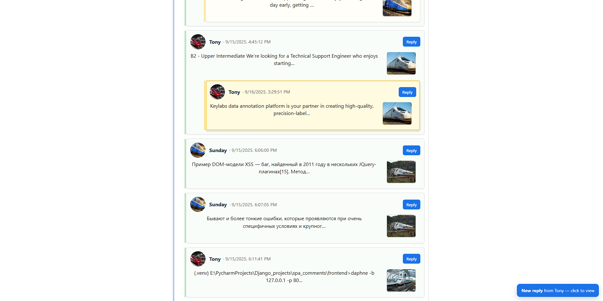


## Installing / Getting started

Prerequisites
Python 3.12+
Docker & Docker Compose (recommended path)
Node.js 20+ & npm (only if you want to run the frontend without Docker)

```shell
git clone https://github.com/Anton-Konyk/spa-comments
cd your-repo
# There's a template at the root of the project: .env.sample.
# Copy it to .env and edit the key fields.
cp backend/.env.sample .env
# There's a template at the /frontend of the project: .env.production.sample
# Copy it to .env.production and edit the key fields.
cp frontend/.env.production.sample frontend/.env.production
# Hint: in Docker dev mode, you usually have the backend on http://localhost:8000,
# the frontend on http://localhost:8080.

#Option A. Dev (SQLite, no Redis/MySQL)
docker compose -f docker-compose-dev.yml up --build

#Option B. Dev (Redis + MySQL)
docker compose -f docker-compose.dev-redis-mysql.yml up --build

#Swagger UI: http://localhost:8000/api/v1/doc/swagger/
```

## Contributing

It's open source code.
If you'd like to contribute, please fork the repository and use a feature
branch. Pull requests are warmly welcome.
